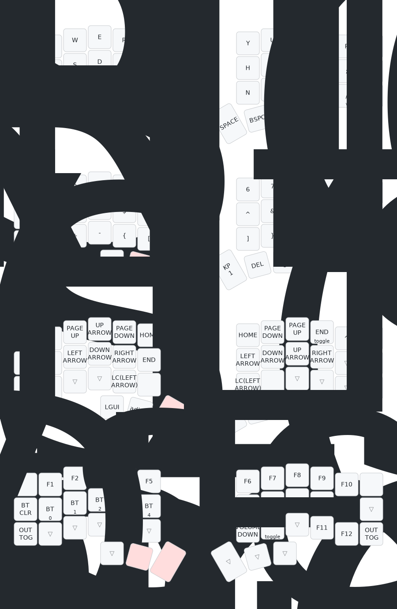

# Wireless corne keyboard zmk configuration

## Setup

To always have the latest layout image run next command:

```bash
ln -s ../../git_hooks/pre-commit .git/hooks/pre-commit
```

## Layout



Layout may be generated using [this tool](https://github.com/caksoylar/keymap-drawer)
or using [web version](https://keymap-drawer.streamlit.app)

Also useful link is [this layout modifier](https://nickcoutsos.github.io/keymap-editor/)
and [github sources](https://github.com/nickcoutsos/keymap-editor)
